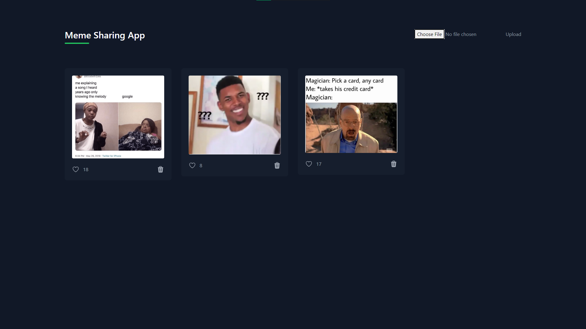

# MemeShare - Meme Sharing App 🤣📤

## Project Description

### Goal
Create a full-stack application with CRUD functions, utilizing a MongoDB database. MemeShare is an app designed for users to upload and share memes with each other. Users can like and delete memes.

 

## How It's Made

### Tech used

- HTML
- CSS (Tailwind CSS)
- Node.js
- Vanilla JavaScript
- Express.js
- MongoDB
- EJS Templating Language
- Multer (for handling file uploads)

### Implementation Details

- **HTML and Tailwind CSS:**
  - Utilized Tailwind CSS for styling to create a visually appealing and responsive user interface.

- **Node.js and Express.js:**
  - Server creation, routing using Express.js, and personal authentication implementation.

- **MongoDB:**
  - Database storage for meme uploads with CRUD functionality.

- **EJS Templating Language:**
  - Used EJS to write JavaScript code in HTML for dynamic content.

- **Multer:**
  - Implemented Multer, an npm package, to handle file uploads.

## Optimizations (Optional)

No specific optimizations were made for this project.

## Lessons Learned 📚

This project provided insights into handling file uploads and managing CRUD operations for meme sharing.

- **EJS Templating Language:**
  - Understanding how to use EJS to write JavaScript code in HTML for dynamic content.

- **Server Creation:**
  - Hands-on experience in creating and starting a server using Node.js and Express.js.

- **Database Integration:**
  - Learning about MongoDB methods for effective data management, especially for CRUD operations.

- **File Upload Challenge:**
  - Overcoming challenges in handling file uploads using the Multer npm package.

## Getting Started 🚀

To get this project up and running, follow these simple steps:

1. **Clone Repository:**
   - Clone this repository using `git clone`.

2. **Navigate to the Project:**
   - `cd` into the project directory.

3. **Install Dependencies:**
   - Run `npm install` to install the necessary dependencies.

4. **Start the Server:**
   - Run `node server.js` to start the server.

5. **Open in Browser:**
   - Visit `http://localhost:3000` in your web browser.

Start sharing and enjoying memes on MemeShare!
